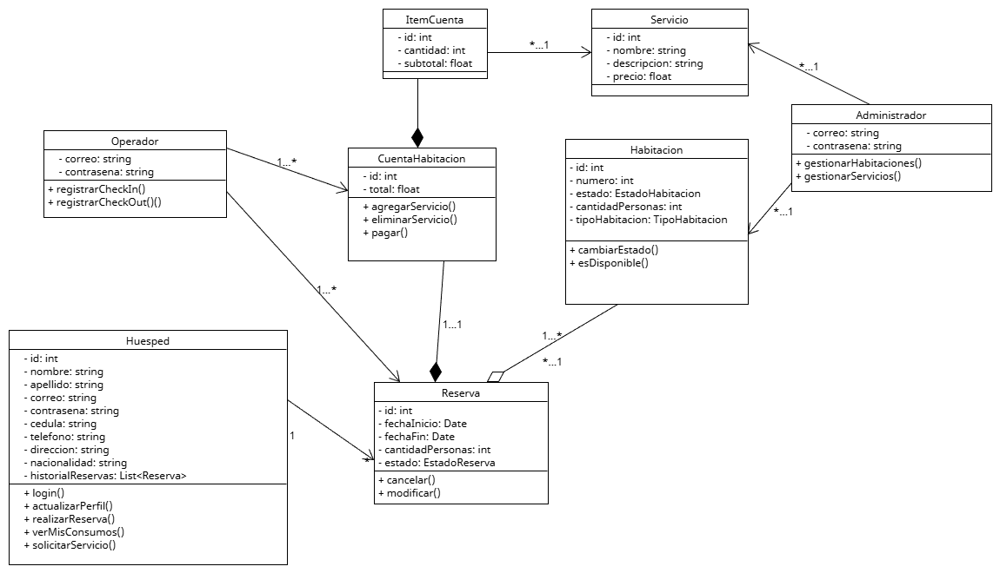

# Hotel Management System

This is a web application for managing a hotel, built with Spring Boot.

## Features

*   **User Management**: Guests can register and manage their accounts.
*   **Room Management**: Administrators can manage room types and individual rooms.
*   **Service Management**: Administrators can manage the services offered by the hotel.
*   **Reservations**: Guests can make reservations for rooms.
*   **Billing**: The system can generate bills for guests.

## Technologies Used

*   **Backend**: Spring Boot, Spring Web, Spring Data JPA
*   **Frontend**: Thymeleaf, HTML, CSS, JavaScript
*   **Database**: H2 Database
*   **Build Tool**: Maven

## Getting Started

To get a local copy up and running, follow these simple steps.

### Prerequisites

*   JDK 17 or later
*   Maven 3.6 or later

### Installation

1.  Clone the repo
    ```sh
    git clone https://github.com/your_username/Proyecto-Desarrollo-Web.git
    ```
2.  Navigate to the `demo` directory
    ```sh
    cd Proyecto-Desarrollo-Web/demo
    ```
3.  Run the application
    ```sh
    ./mvnw spring-boot:run
    ```

The application will be available at `http://localhost:8080`.

## Project Structure

The project is structured as a standard Maven project:

```
.
├── demo
│   ├── src
│   │   ├── main
│   │   │   ├── java
│   │   │   │   └── com
│   │   │   │       └── example
│   │   │   │           └── demo
│   │   │   │               ├── controller
│   │   │   │               ├── entities
│   │   │   │               ├── repository
│   │   │   │               └── service
│   │   │   └── resources
│   │   │       ├── static
│   │   │       └── templates
│   └── pom.xml
└── docs
    ├── Diagrama entidad Relacion.png
    └── Diagramaclases.png
```

## Database

The application uses an in-memory H2 database. The database console is available at `http://localhost:8080/h2-console` with the following properties:

*   **Driver Class**: `org.h2.Driver`
*   **JDBC URL**: `jdbc:h2:mem:hoteldb`
*   **User Name**: `sa`
*   **Password**: 

## ER Diagram


## Class Diagram



## License

Distributed under the MIT License. See `LICENSE` for more information.
